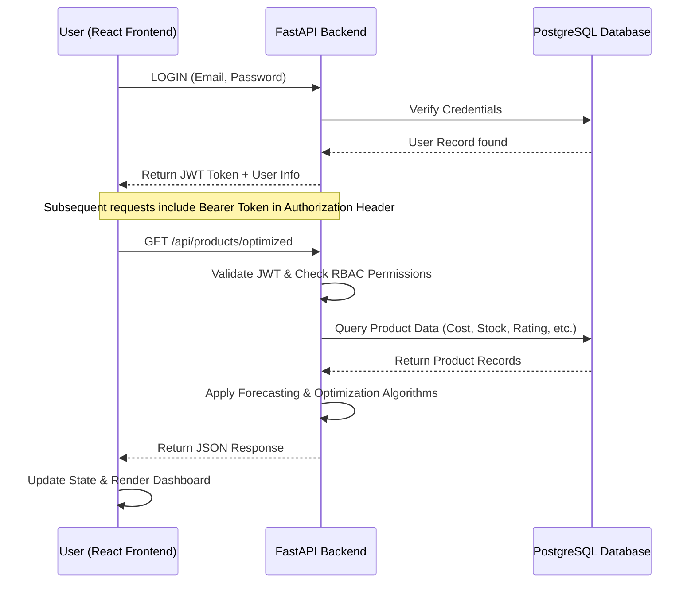

# Technical Documentation: Price Optimization Tool

## 1. Project Overview
The Price Optimization Tool is a full-stack application designed to help businesses manage their product catalog, forecast demand based on historical and real-time data, and optimize pricing strategies to maximize revenue. The system implements a robust Role-Based Access Control (RBAC) system to ensure data security and integrity.

## 2. System Architecture
The application follows a standard Client-Server architecture:
- **Frontend**: A modern React application built with Vite, utilizing Chart.js for data visualization and Axios for API communication.
- **Backend**: A high-performance FastAPI server using SQLAlchemy ORM for database interactions.
- **Database**: PostgreSQL (relational database) with indexed high-traffic columns.
- **Authentication**: JWT (JSON Web Token) based stateless authentication.
- **Access Control**: Dynamic CORS origin filtering via `ALLOWED_ORIGINS` environment variable.

### 2.1 System Sequence Diagram
The following diagram illustrates the flow of a standard request (e.g., fetching optimized prices) including authentication, permission checking, and business logic execution.

## 3. Technology Stack

### Backend
- **Framework**: FastAPI
- **Language**: Python 3.12+
- **ORM**: SQLAlchemy
- **Database**: PostgreSQL
- **Security**: Passlib (Bcrypt hashing), PyJWT, SendGrid (Email Verification)
- **Machine Learning**: Scikit-learn (Linear Regression), NumPy
- **Validation**: Pydantic

### Frontend
- **Framework**: React 19 (Vite)
- **Routing**: React Router 7
- **APIs**: Axios
- **Charts**: Chart.js / React-chartjs-2
- **Styling**: Vanilla CSS (Custom Variable System)

---

## 4. Backend Documentation

### Database Models (`models.py`)
- **User**: Stores credentials, role, and verification status. Indexed by `email` and `role`.
- **RolePermission**: A dynamic table mapping roles to specific actions (e.g., `product_create`, `product_read`).
- **Product**: The core entity storing all required attributes:
    - `name`, `description`, `cost_price`, `selling_price`, `category`, `stock_available`, `units_sold`, `customer_rating`.
    - `demand_forecast`: Calculated value.
    - `optimized_price`: Recommended pricing.
    - `created_at`, `updated_at`: Audit timestamps.

### Key Logic & Formulas
#### Demand Forecasting (ML-Powered)
The system transition from simple heuristic formulas to a **Linear Regression model** implemented via Scikit-learn.
- **Features**: `cost_price`, `selling_price`, `stock_available`, `units_sold`, `customer_rating`.
- **Training**: The model is trained dynamically on the current product dataset.
- **Feedback Loop**: Predicts demand by scaling features and applying the trained linear weight.

#### Price Optimization (Dynamic)
The system calculates a suggested price based on:
1. **ML Demand Forecast**: Predicted demand relative to the fleet average.
2. **Demand Factor**: A multiplier (capped between 0.8 and 1.5) applied to the profit margin.
3. **Guardrails**: Ensuring the optimized price is never below the cost price.

---

## 5. Frontend Documentation

### Application Structure
- **`/login`**: Handles authentication and account creation.
- **`/landing`**: Dashboard overview with navigation to core modules.
- **`/products`**: Management interface for CRUD operations with toggleable demand forecast columns.
- **`/optimization`**: Dedicated view for comparing current vs. optimized prices across categories.

### Design System
- **Theme**: Premium Dark Mode (#1a1a1a background).
- **Accents**: Vibrant Mint (#00D4AA) for calls-to-action and success states.
- **Components**: Functional modals for adding/editing products and visualizing data.

---

## 6. API Reference
- **Auth**:
  - `POST /api/auth/register`: Create new buyer account.
  - `POST /api/auth/login`: Obtain JWT token.
- **Products (Public Routes)**:
  - `GET /api/products`: List all products (supports fuzzy search/filter).
  - `GET /api/products/{id}`: View specific product details.
- **Products (Protected Routes)**:
  - `POST /api/products`: Create new product (Supplier/Admin).
  - `GET /api/products/forecast`: High-level demand forecasting data.
  - `GET /api/products/optimized`: Suggested pricing report.
- **Users/Admin**:
  - `GET /api/users/permissions`: Manage RBAC table mappings.

---

## 7. Security Features
- **Stateless Auth**: JWT tokens with expiration validation.
- **Email Verification**: Mandatory verification flow via SendGrid to protect against fake accounts.
- **Database Optimization**: Database-level indexing on high-traffic columns (`email`, `role`, `name`, `category`, `prices`) to ensure sub-second query performance.
- **Encryption**: Bcrypt for all password storage.
- **RBAC Enforcement**: Middleware checks for every destructive action.
- **Audit Logs**: Automatic tracking of creation and modification timestamps (`created_at`, `updated_at`).
- **CORS Protection**: Access restricted to specific domains via configurable origins.
- **Performance Indexing**: High-traffic search columns (`name`, `category`, `cost_price`) are indexed at the database level.
